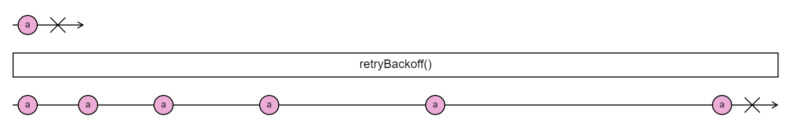

# AMS-AFT Core: RxJS

## retryBackoff RxJS operator

Returns an Observable that mirrors the source Observable with the exception of an error using a backoff strategy.

```ts
function retryBackoff<T, E extends Error>(config?: RetryBackoffConfig<E>): MonoTypeOperatorFunction<T>;
```

A function that returns an Observable that will resubscribe to the source stream when the source stream errors using a backoff strategy.



### Exposed types

```ts
interface RetryBackoffConfig<E extends Error> {
  count?: number | (() => number);
  baseInterval?: number | (() => number);
  shouldRetry?: boolean | ((scope: RetryBackoffScope<E>) => boolean);
  delay?: number | ((scope: RetryBackoffScope<E>) => number);
  shouldNotRetry?: boolean | ((scope: RetryBackoffScope<E> & { delay: number }) => boolean);
  tap?: (scope: RetryBackoffScope<E> & { delay: number }) => void;
  resetOnSuccess?: boolean | (() => boolean);
}
```

```ts
interface RetryBackoffScope<E extends Error> {
  count: number;
  baseInterval: number;
  resetOnSuccess: boolean;
  error: E;
  retryCount: number;
  totalTime: number;
}
```

### Use cases

#### Configure the number of retries and base interval depending on the time of the day

```ts
function count(): number {
  const hour = Date.now().getHours();

  return hour <= 6 || hour >= 20 ? 7 : 2;
}

function baseInterval(): number {
  const hour = Date.now().getHours();

  return hour <= 6 || hour >= 20 ? getRandomBetween(500, 600) : getRandomBetween(200, 300);
}

source$.pipe(retryBackoff({ count, baseInterval })).subscribe();
```

#### Retry only on certain error types

```ts
function shouldRetry<E extends Error>(scope: RetryBackoffScope<E>): boolean {
  return scope.error instanceoff URIError;
};

source$.pipe(retryBackoff({ shouldRetry })).subscribe();
```

#### Define a maximum delay

```ts
function delay<E extends Error>(scope: RetryBackoffScope<E>): number {
  const maxDelay = 2_000;
  const backoffDelay = Math.pow(2, scope.retryCount - 1) * scope.baseInterval;

  return Math.min(maxDelay, backoffDelay);
}

source$.pipe(retryBackoff({ delay })).subscribe();
```

#### Define a maximum operation time

```ts
function shouldNotRetry<E extends Error>(scope: RetryBackoffScope<E> & { delay: number }): boolean {
  const maxTime = 2_000;

  return scope.delay + scope.totalTime > maxTime;
}

source$.pipe(retryBackoff({ shouldNotRetry })).subscribe();
```

#### Log every retry

```ts
function tap<E extends Error>(scope: RetryBackoffScope<E> & { delay: number }) {
  console.log(`Retry number ${scope.retryCount} from error ${scope.error.name}`, scope);
}

source$.pipe(retryBackoff({ tap })).subscribe();
```
